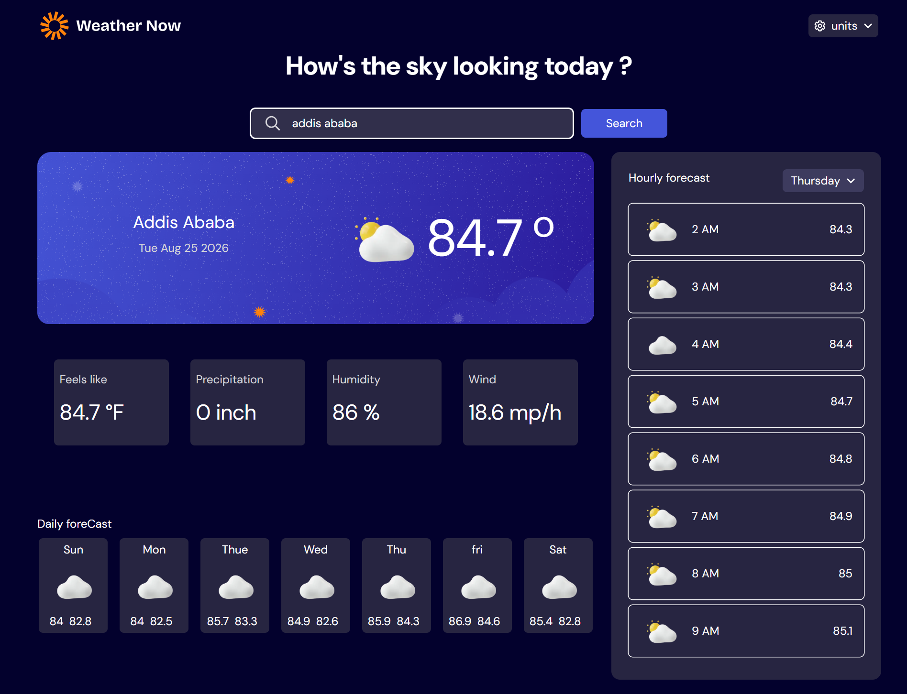

# 🌤️ Weather App

A modern weather application that provides users with **current weather information** and detailed weather data for a selected location.

The app is designed to present weather information in a clear and user-friendly interface.

## ✨ Features

* 🌡️ Display current temperature
* 🌤️ Show current weather conditions
* 💧 Display additional weather details
* 📍 View weather information based on location
* 📊 Detailed weather data
* 📱 Responsive user interface

## 🛠️ Technologies Used

This project was built mainly using:

* **React** — for building the user interface and managing components
* **Tailwind CSS** — for styling and creating a responsive design
* **JavaScript** — for application logic and data handling

The application should now be running locally.

-Screenshot

- 🔮 Future Improvements

- Improve component architecture and organization
- Improve animations and UI interactions

